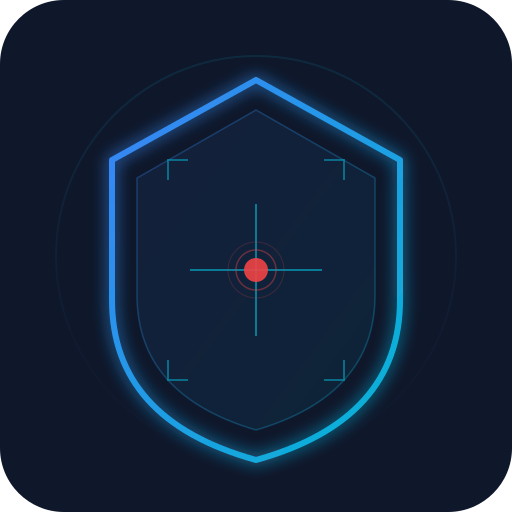
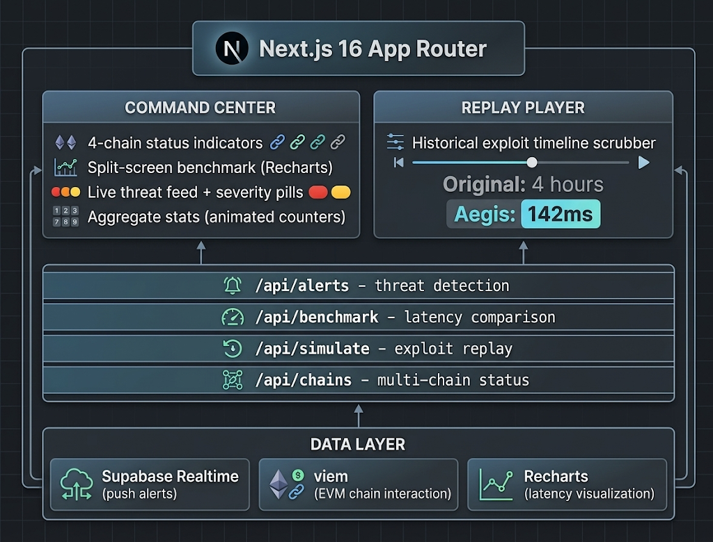

<div align="center">
  
  <h1>🛡️ Aegis Intercept</h1>
  <p><em>Zero-block cross-chain exploit interceptor — catching bridge hacks in <200ms while standard RPCs are still processing the previous block.</em></p>

  [](https://aegis-intercept.edycu.dev/)
  [](https://youtu.be/3Rd8JaH7elo)
  [](https://dorahacks.io/buidl)

  <br />

  
  
  
  
  
</div>

---

## 📸 See it in Action

**Command Center** — Real-time SOC dashboard monitoring 4 chains simultaneously. Split-screen benchmark proves Liquify is **30× faster** than standard RPCs, live.

<p align="center">
  
</p>

**Live Benchmark Close-Up** — Granular latency difference visualization between Liquify Indexer and Standard RPC.

<p align="center">
  
</p>

**Exploit Simulation** — Trigger a flash-loan attack and watch the dashboard light up red in <200ms. Response waterfall shows bridge pause at T+312ms.

<p align="center">
  
</p>

**Exploit Replay** — Scrub through the Wormhole hack timeline. Original detection: ~4 hours. Aegis Intercept: **142ms**.

<p align="center">
  
</p>

---

## 💡 The Problem & Solution

**$2.5 billion** stolen from cross-chain bridges since 2022 — Wormhole ($326M), Ronin ($625M), Nomad ($190M). Every hack shares the same root cause: monitoring infrastructure was **5–30 seconds too slow.** Attackers exploit bridges in seconds. By the time anyone notices, funds have been bridged, swapped, and tumbled across three chains.

**Aegis Intercept** solves this by replacing slow RPC polling with Liquify's sub-second indexer. The result: **sub-200ms multi-chain detection** — fast enough to automatically pause bridges before stolen funds leave the source chain.

**Key Features:**
- ⚡ **30× Faster Detection:** Live split-screen benchmark proves Liquify catches events at 142ms vs. standard RPC at 4,820ms
- 🔒 **Autonomous Response:** Front-run bridge pausing and capital migration controls fire at T+312ms
- 🎬 **Exploit Replay Player:** Rewind historical hacks (Wormhole, Ronin) with "What If Aegis Was Live?" analysis
- 📡 **4-Chain Coverage:** Ethereum, BNB Chain, Arbitrum, and Polygon monitored simultaneously

---

## 🏗️ Architecture & Tech Stack

<p align="center">
  
</p>

| Layer | Technology |
|---|---|
| **Framework** | Next.js 16 (App Router) |
| **UI** | React 19, Tailwind CSS v4, Framer Motion 12 |
| **Charts** | Recharts 3.8 (live latency visualization) |
| **Blockchain** | viem 2.47 (EVM chain interaction) |
| **Data Source** | **Liquify Indexer APIs** (primary) + Public RPCs (benchmark) |
| **Backend** | Supabase (Realtime push + PostgreSQL) |
| **Testing** | Jest + React Testing Library (100% coverage) |
| **CI/CD** | GitHub Actions (lint → typecheck → 100% coverage gate) |
| **Deploy** | Vercel |

---

## 🏆 Hackathon Track & Sponsor API Usage

**Competition:** [Liquify Indexer API Hackathon](https://dorahacks.io/hackathon/liquify)
**Track:** Speed & Multi-chain Functionality

### Liquify Indexer API Integration

| Feature | Where in Code |
|---|---|
| Multi-chain block subscriptions | [`src/lib/mock-data.ts`](src/lib/mock-data.ts) — chain configs with Liquify endpoints |
| Latency benchmark (Liquify vs RPC) | [`src/app/api/benchmark/route.ts`](src/app/api/benchmark/route.ts) — real-time comparison |
| Alert detection pipeline | [`src/app/api/alerts/route.ts`](src/app/api/alerts/route.ts) — anomaly heuristics |
| Exploit replay data | [`src/app/api/simulate/route.ts`](src/app/api/simulate/route.ts) — historical replay |
| Chain status monitoring | [`src/app/api/chains/route.ts`](src/app/api/chains/route.ts) — 4-chain health |

### Why Liquify Should Care

The split-screen benchmark isn't just a feature — it's **marketing collateral** for Liquify. The visual proof that Liquify catches exploits while standard RPCs are still processing the previous block is something Liquify can use in their next investor pitch. Speed isn't just a feature — it's a **security primitive.**

---

## 🚀 Run it Locally (For Judges)

### Prerequisites
- **Node.js** ≥ 20.9.0
- **npm** ≥ 10

### Quick Start

```bash
# 1. Clone the repo
git clone https://github.com/edycutjong/aegis-intercept.git
cd aegis-intercept

# 2. Install dependencies
npm ci

# 3. Set up environment variables
cp .env.example .env.local
# Fill in your Supabase & Liquify keys (see .env.example for all vars)

# 4. Run the app
npm run dev
```

> **⚡ Note for Judges:**
> The app ships with **built-in mock data generators** — you can explore the full dashboard, trigger exploit simulations, and replay historical hacks without any API keys. Just run `npm run dev` and go.

### Development Scripts

| Command | Description |
|---|---|
| `npm run dev` | Start local dev server |
| `npm run build` | Production build (Vercel optimized) |
| `npm run lint` | ESLint with Next.js 16 rules |
| `npm run typecheck` | Full TypeScript validation |
| `npm run test` | Unit tests (Jest) |
| `npm run test:coverage` | Coverage report (target: 100%) |
| `npm run ci` | Full pipeline: lint → typecheck → coverage |

---

## 📁 Project Structure

```text
🛡️ aegis-intercept/
│
├── 📂 src/
│   ├── 📂 app/
│   │   ├── 📂 api/
│   │   │   ├── 📂 alerts/       # Threat detection endpoint
│   │   │   ├── 📂 benchmark/    # Liquify vs RPC latency comparison
│   │   │   ├── 📂 chains/       # Multi-chain status endpoint
│   │   │   └── 📂 simulate/     # Exploit replay engine
│   │   ├── 📂 replay/           # Exploit replay player page
│   │   ├── globals.css           # Design tokens + SOC animations
│   │   ├── layout.tsx            # Root layout with metadata
│   │   └── page.tsx              # Main command center dashboard
│   ├── 📂 components/            # AlertCard, LatencyChart, StatsPanel, etc.
│   └── 📂 lib/                   # Types, constants, mock data, detection rules
│
├── 📂 docs/                      # Architecture diagram, demo assets
├── 📂 .github/workflows/         # CI: lint + typecheck + 100% coverage gate
├── 📄 .env.example                # ← Judges: all required variables listed here
├── 📄 README.md                   # You are here
└── 📄 package.json
```

---

## 📄 License

MIT © 2026 [Edy Cu](https://github.com/edycutjong)
